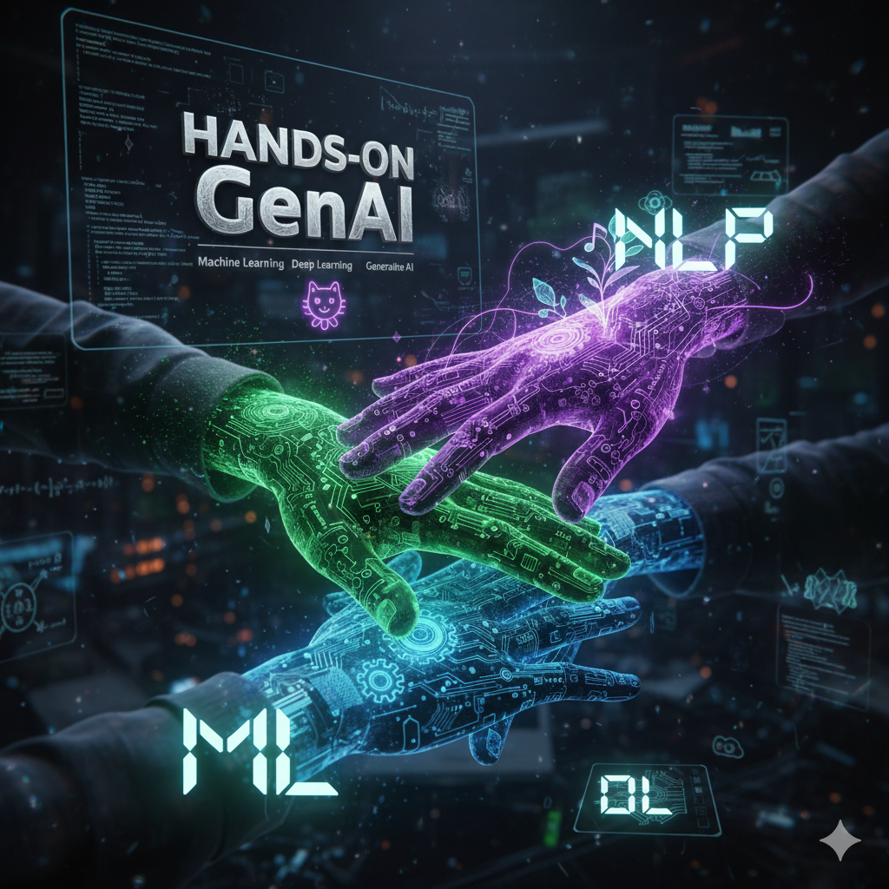

# Hands-on GenAI: Machine Learning, Deep Learning, and NLP.



## Getting Started

In Google Colab:

```
from google.colab import drive
drive.mount('/content/drive')
```

Then CD into the Colab Notebooks
```
!cd /content/drive/MyDrive/Colab Notebooks
```

Clone this repo 
```
!git clone https://github.com/tatwan/handson-genai.git
```


## Outline 

### **Course Overview:**

Hands-on Generative AI is an interactive three-day training course that offers a comprehensive learning experience for developers, data engineers/analysts, and tech product owners. The course is specifically designed to equip participants with the essential skills and in-depth knowledge required to harness the power of generative AI effectively. By combining theory with extensive hands-on practice, this course ensures that participants gain a deep understanding of generative AI concepts and the ability to apply them to various domains. Students will learn how to generate realistic and novel outputs, such as images, music, text, and more, using state-of-the-art algorithms and frameworks.

**Course Duration:** This course will be delivered in 3 days

### **Prerequisites:**

* **Python Programming:** Participants should have a solid understanding of Python programming, including knowledge of data structures, control flow, functions, and libraries commonly used in data analysis and machine learning, such as NumPy, Pandas, and scikit-learn.
* **Data Analysis and Machine Learning:** Familiarity with data analysis concepts, exploratory data analysis (EDA), and machine learning algorithms is essential.
* **Deep Learning Basics:** Basic knowledge of deep learning concepts is recommended.

## **Course Outline:**

### Day 1

* **Foundations of AI and Machine Learning**
  * Machine Learning vs rule-based programming.
  * Supervised and unsupervised learning. Examples and applications in real-world scenarios.
  * An overview of ML model development and evaluation:
    * Data preprocessing
    * Feature engineering
    * Overfit
    * Model evaluation metrics
  * *Hands-on Lab (optional):* Training and evaluating a classifier.
* **Deep Learning Primer**
  * Fundamental concepts of deep learning
  * Data types and volumes
  * Overview of neural network structures and common architectures.
  * Optimizers, gradient descent, and backpropagation algorithms.
  * Optional demo: Tensorflow playground
  * Deep learning frameworks: TensorFlow and PyTorch
  * *Hands-on Lab:* Image classification using TensorFlow or PyTorch.
* **Overview of Generative AI**
  * Introduction to Generative AI and its applications.
  * Basic principles of generative models and their architectural components.
  * Demo: a simple example of probabilistic sampling to create simulated data
  * Autoencoders: latent space, and representation learning.
  * *Hands-on Lab:* Autoencoders. Understanding latent space using the MNIST dataset
  * Variational Autoencoders (VAEs) and probabilistic sampling techniques.
  * *Hands-on Lab:* Training a VAE to generate fake images of handwritten digits.

### Day 2

* **NLP: Understanding Language as Data**
  * Introduction to NLP techniques and applications
  * Tokenization
  * Vectorization. Bag-of-Words and its limitations
  * Embeddings: mathematical text representation in a continuous vector space.
  * *Hands-on Lab:* Find similar documents using word2vec.
* **Large Language Models (LLMs)**
  * NLP and text generation before the introduction of pre-trained LLMs.
  * Overview of pre-trained models:
    * BERT
    * GPT
  * Demo: GPT as a probabilistic autoregressive model (OpenAI Playground)
  * Other notable LLMs and their applications.
  * Demo: A Tour of Huggingface
  * *Hands-on Lab:* Introduction to BERT and GPT
* **Language generation tasks and Prompting Techniques**
  * Generative tasks:
    * Text completion
    * Dialogue systems
    * Summarization
    * Code generation
    * Prompt refinement
  * Prompt engineering and prompting techniques
  * *Hands-on Lab (no code):* Prompting techniques for summarization, code generation and text labelling

### Day 3

* **Adapting Pre-trained Models for Specific NLP Tasks**
  * Transfer learning and full fine-tuning strategies for LLMs.
  * Considerations for cost and potential catastrophic forgetfulness.
  * Using Hugging Face's transformers library for fine-tuning
  * *Hands-on Lab:* Fine tuning BERT for sentiment analysis
  * Sampling techniques
  * *Hands-on Lab:* Customize Generative LLM Output with Temperature, Top-P, Top-K, and Beam Search
  * Retrieval-Augmented Generation (RAG)
  * Strategies for deploying generative models:
    * Quantization, pruning, and distillation techniques
* Hands-on Lab (optional): model distillation
* **Capstone Project**
  * Developing a Dialogue System with RAG

## **Timing Guide**

Day 1

* Foundations of AI and Machine Learning
* Deep Learning Primer
* Overview of Generative AI

Day 2

* NLP: Understanding Language as Data
* Large Language Models (LLMs)
* Language generation tasks and Prompting Techniques

Day 3

* Adapting Pre-trained Models for Specific NLP Tasks
* Capstone Project

