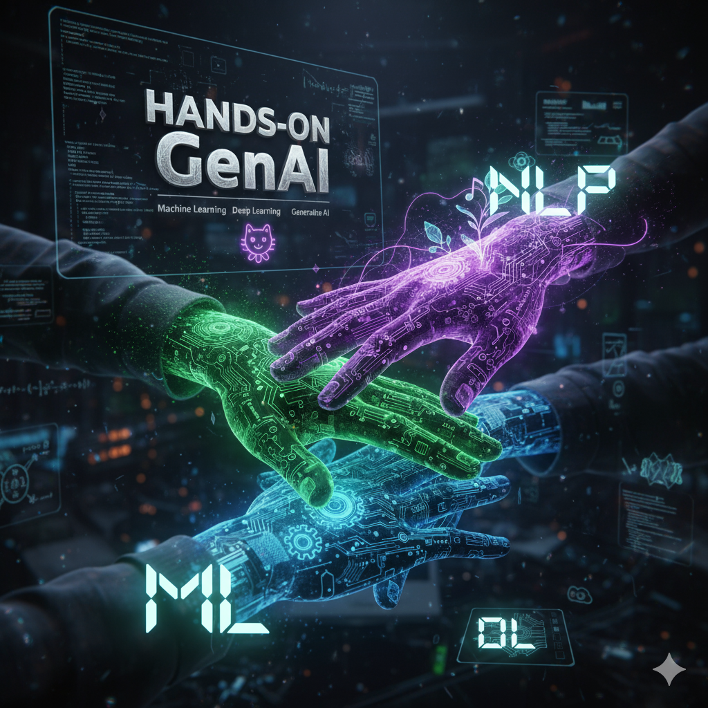

# Hands-on GenAI: Machine Learning, Deep Learning, and NLP



## Getting Started

In Google Colab:

```python
from google.colab import drive
drive.mount('/content/drive')
```

Then CD into the Colab Notebooks:
```
!cd /content/drive/MyDrive/Colab\ Notebooks
```

Clone this repo:
```
!git clone https://github.com/tatwan/handson-genai.git
```

---

## Course Overview

Hands-on Generative AI is an interactive **three-day training course** that offers a comprehensive learning experience for developers, data engineers/analysts, and tech product owners. The course is specifically designed to equip participants with the essential skills and in-depth knowledge required to harness the power of generative AI effectively.

**Course Duration:** 3 Days

---

## Course Modules

### 📁 Module Structure

```
handson-genai/
├── Module_01_ML_Foundations/      # Day 1
│   └── 01_intro_to_ml_concepts.ipynb
├── Module_02_Deep_Learning/       # Day 1
│   └── 01_neural_network_basics.ipynb
├── Module_03_Generative_AI/       # Day 1
│   ├── 01_intro_to_generative_ai.ipynb
│   └── 02_autoencoders.ipynb
├── Module_04_NLP/                 # Day 2
│   ├── 01_intro_to_nlp.ipynb
│   ├── 02_tokenization.ipynb
│   └── 03_embeddings.ipynb
├── Module_05_LLMs/                # Day 2
│   ├── 01_openai_ollama.ipynb
│   ├── 02_huggingface_tour.ipynb
│   └── 03_bert_gpt.ipynb
├── Module_06_Prompting/           # Day 2
│   ├── 01_prompting_techniques.ipynb
│   ├── 02_function_calling.ipynb
│   └── 03_react_agent.ipynb
├── Module_07_Fine_Tuning/         # Day 3
│   ├── 01_transfer_learning.ipynb
│   ├── 02_fine_tuning_openai.ipynb
│   └── 03_sampling_techniques.ipynb
├── Module_08_RAG/                 # Day 3
│   ├── 01_rag_langchain.ipynb
│   ├── 02_rag_llamaindex.ipynb
│   └── 03_rag_evaluation.ipynb
└── Module_09_Capstone/            # Day 3
    └── capstone_dialogue_system.ipynb
```

---

## Day-by-Day Outline

### Day 1: Foundations

#### Module 1: Foundations of AI and Machine Learning
- Machine Learning vs rule-based programming
- Supervised and unsupervised learning with examples
- ML model development workflow: preprocessing, features, overfitting, evaluation
- **Lab:** `01_intro_to_ml_concepts.ipynb`

#### Module 2: Deep Learning Primer
- Fundamental concepts of neural networks
- Optimizers, gradient descent, and backpropagation
- Deep learning frameworks: TensorFlow and PyTorch
- **Lab:** `01_neural_network_basics.ipynb`

#### Module 3: Overview of Generative AI
- Introduction to Generative AI and applications
- Probabilistic sampling and latent space concepts
- Autoencoders and VAEs
- **Labs:** `01_intro_to_generative_ai.ipynb`, `02_autoencoders.ipynb`

---

### Day 2: NLP and LLMs

#### Module 4: NLP - Understanding Language as Data
- Tokenization and text preprocessing
- Vectorization and embeddings
- **Labs:** `01_intro_to_nlp.ipynb`, `02_tokenization.ipynb`, `03_embeddings.ipynb`

#### Module 5: Large Language Models (LLMs)
- Pre-trained models: BERT and GPT
- Working with OpenAI and Ollama
- HuggingFace ecosystem tour
- **Labs:** `01_openai_ollama.ipynb`, `02_huggingface_tour.ipynb`, `03_bert_gpt.ipynb`

#### Module 6: Prompting Techniques
- Zero-shot, few-shot, and chain-of-thought prompting
- Function calling and tool use
- ReAct agents
- **Labs:** `01_prompting_techniques.ipynb`, `02_function_calling.ipynb`, `03_react_agent.ipynb`

---

### Day 3: Advanced Topics & Capstone

#### Module 7: Adapting Pre-trained Models
- Transfer learning and fine-tuning strategies
- Catastrophic forgetting prevention
- Sampling techniques: Temperature, Top-P, Top-K
- **Labs:** `01_transfer_learning.ipynb`, `02_fine_tuning_openai.ipynb`, `03_sampling_techniques.ipynb`

#### Module 8: Retrieval-Augmented Generation (RAG)
- RAG architecture with LangChain and LlamaIndex
- Vector stores and semantic search
- RAG evaluation and observability
- **Labs:** `01_rag_langchain.ipynb`, `02_rag_llamaindex.ipynb`, `03_rag_evaluation.ipynb`

#### Module 9: Capstone Project
- Build a complete RAG-based dialogue system
- **Lab:** `capstone_dialogue_system.ipynb`

---

## Prerequisites

- **Python Programming:** Solid understanding including data structures, control flow, functions, and libraries (NumPy, Pandas, scikit-learn)
- **Data Analysis and Machine Learning:** Familiarity with data analysis concepts and ML algorithms
- **Deep Learning Basics:** Basic knowledge of deep learning concepts is recommended

---

## Archived Content

Previous demos and labs are available in the `_archive/` folder for reference.
